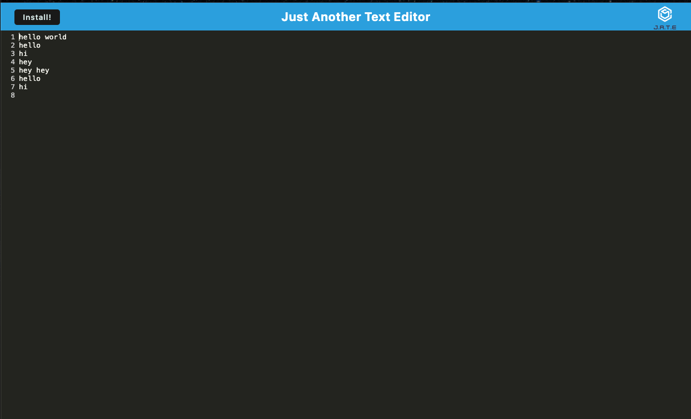

# JATE Text Editor
## License
 
 ## Table of Contents
 * [Description](#description)
 * [Usage](#usage)
 * [License](#license)
 * [Questions](#questions)
 * [Photo](#photo)
 ## Description
   A text editor that uses javascript to take notes with syntax highlighting. 
  ## Usage
  Visit: insert deployed link
  ## Questions
   https://github.com/akidd15
## Photo
